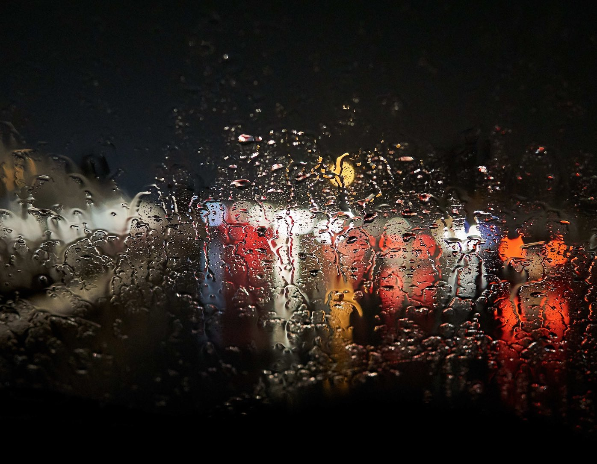

## Paniek aanval na een avondje stappen
Deze ochtend reed ik terug naar huis van een avondje stappen. 
Omdat ik een jaar lang geen alcohol probeer te drinken, mede omdat ik aan mezelf aan het werken ben op mentaal vlak, was ik de BOB die avond.

De rit op weg naar huis de dag erna was echter een emotionele rollercoast. 
Eigenlijk begon die heel goed. Ik was blij dat ik de avond stappen was doorgekomen zonder echte paniek aanvallen.

Op eigen één moment na, toe ik in een overvolle doorgang stond richting het toilet in de kroeg. 
Geen slimme en fijne plek om te staan. Uiteindelijk geleerd dat het oké is om soms even weg te lopen en rustig naar de wc te gaan, terwijl je eigenlijk helemaal niet zo erg hoeft te plassen. 
Gewoon om even tot mezelf te komen en de prikkels even te stoppen. 

Ik heb geleerd dat een trauma, wat paniekaanvallen volgens mij zijn, erger wordt als je het gevoel hebt dat je niet weg kunt. 
Ik kon op dat moment fysiek wel weg, maar het is natuurlijk raar om zonder reden weg te lopen van je vrienden. 
Je kunt dus, voor mijn gevoel(!), ook maar één keer per 20(?) minuten ofzo naar de wc gaan, anders valt het op. 

## Hevige regen als trigger paniek aanval
Terug naar de autorit op de terugweg. Ik was dus blij en opgewekt. 
Dacht dat ik de paniekaanvallen nu eindelijk onder controle had, door gewoon vaak genoeg terug te keren in je lichaam als ik merkt dat ik weer paniekerige gedacht krijg, vooral negatieve gedachten waar ik mezelf een paniek aanval aanpraat en bang ben er weer een te krijgen. 

Op dat moment had ik nog niet ontbeten en moest ik tanken. 
Dus ik stopte bij een tankstation en nam bij het afrekenen ook nog een broodje en een cappuccino. 
Heerlijk vind ik dat. 

Ongeveer een half uur later op de terugweg, kreeg ik tijdens het rijden op de snelweg een paniek aanval die ik allang niet meer had gehad. 
Het leek een eeuwigheid te duren maar ik denk dat die uiteindelijk ‘maar’ een secode of 20 duurde. 
De hevigste seconden in lange tijd. Ik zat dus in de auto, met een hevige regenval. 
Alles leek om me heen een beetje wazigere te worden en er leek een tunnel visie te ontstaan. 
Mijn hart ging flik tekeer en ik wilde vluchten. 

_Tekst gaat verder onder afbeelding._

Op dat moment lukte het mij om te beseffen dat ik moest gaan ‘voelen’, het bewust aanwezig zijn in mijn lichaam. 
Maar dat is makkelijker gedacht dan gedaan. Ik werd me bewust van hoe heet mij lichaam was. 
Innerlijk voelde ik een gloed van warmte. Mijn spieren stonden allemaal gespannen en mijn hart ging tekeer. 
In eerste instantie zorgde dat er juist door dat de paniek nog heviger werd. 
Eigenlijk wil je dan juist vluchten van je eigen lichaam, het wegstoppen en er niet meer aan denken. 
Het is dus vreselijk moeilijk, bijna onmogelijk, om bewust te blijven in de fysieke ‘pijn’ die je ervaart. 

## Het is letterlijk een energie van pijn die er uit moet. 
Het eruit krijgen van deze energie doe je alleen door er bewust op te focussen. 
Hoe moeilijk het ook is, het gaan niet weg door ergens anders aan te denken. 
Je onderdrukt het dan alleen maar. Ik heb dus geleerd om de ‘pijn’ te accepteren en niet meer weg te stoppen. 
Hoewel ik dit nu geleerd heb, zal ik het waarschijnlijk nog vaak moeten doen wil het ooit draagbaar worden.
Daarnaast lukt het me lang niet altijd.  
Wel ben ik dankbaar voor deze les. Ooit weet ik dat ik hierdoor bewuster in het leven ga staan, wat soms nu al het geval is. 
De paniekaanvallen zijn dus een soort van training voor mijn om bewuster in het hier en nu te leven.
